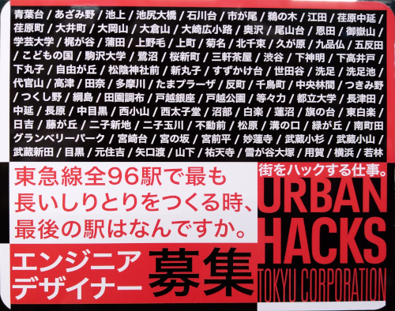

# これは何？

(2022年5月5日撮影)

# 前提

- 「最も長いしりとり」は駅の数が最も多くなるしりとりとする。駅名の長さの総和が最も大きくなるしりとりではない。
- 駅名はカタカナで扱う。濁音・半濁音と静音は区別する。
  - 例：「エダ」から「タマガワ」へはつながらないが「ダイカンヤマ」へはつながる。
- 拗音で終わる駅名からのつながりは規定しない。全96駅の中に拗音で終わる駅名は存在しない。
- 答えが複数存在する場合、それらの少なくともひとつを導く。

# 解き方

駅を節、しりとりのつながりを枝とした有向グラフとして問題を表現し、 ナイーブに総当りする。

-----

Takashi Menjo &lt;takashi DOT menjo PLUS github AT gmail DOT com&gt;
